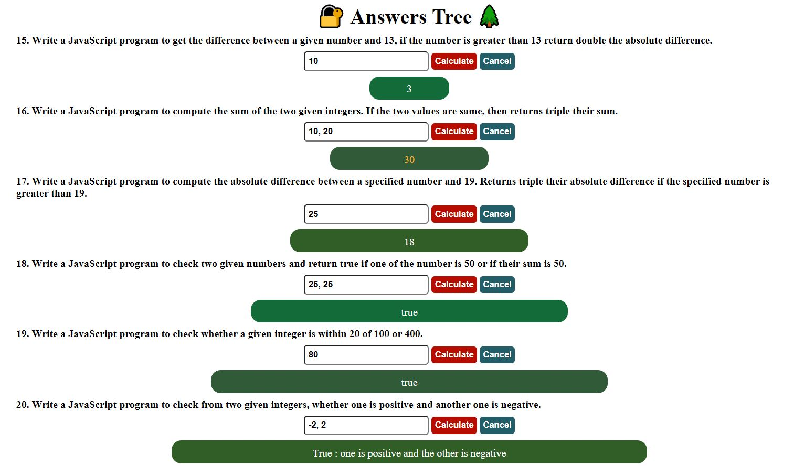
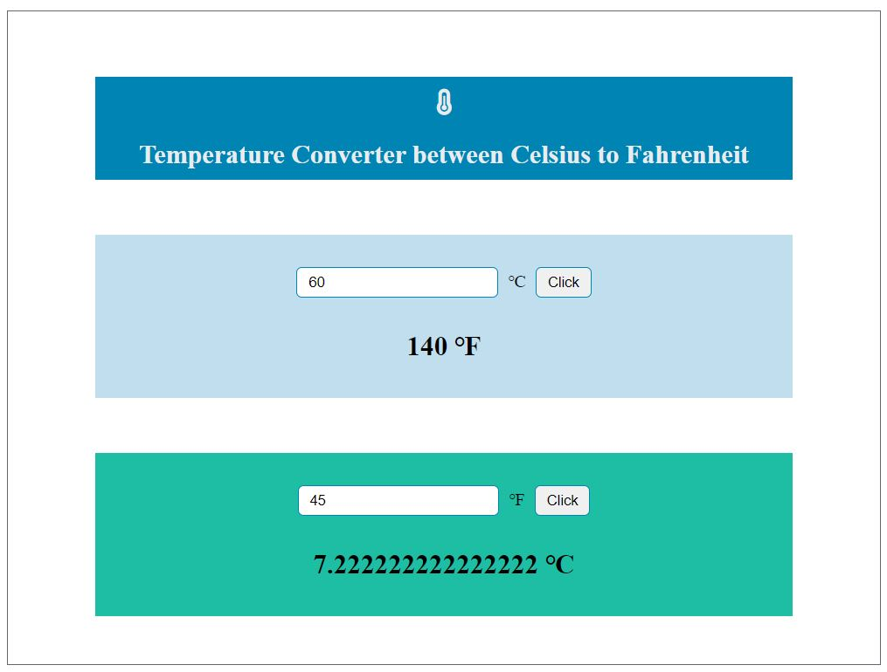

# JavaScript basic excercises from [w3resource](https://www.w3resource.com/javascript-exercises/javascript-basic-exercises.php)
## This is going to be my daily log for JavaScript coding practice.

📅 06/12/2022
- basic function



- get the extension of a filename
```
const btn = document.querySelector("#btn");
const filename = document.querySelector("#filename");
const result = document.querySelector("#result");

btn.addEventListener("click", () => {
    console.log(filename.value);
    result.innerHTML =
        `<p>The file name is ${filename.value.split(".")[0]}</p>
         <p>the file extension is ${filename.value.split(".")[1]}</p>
        `
})
```
<hr>

📅 05/12/2022
- create a variable using a user-defined name
```
const btn = document.querySelector("#btn");
const named = document.querySelector("#named");
const result = document.querySelector("#result");

btn.addEventListener("click", () => {
    this[named.value] = 10;
    result.innerHTML = `<p>${named.value}</p> 
    <p>${named.value} = ${this[named.value]}</p>`;
})
```
<hr>

📅 03/12/2022
- how to run a JavaScript code in Node.js
```
// This part is needed to run a JavaScript program in Node.js.  
const readline = require('readline');
const rl = readline.createInterface({
    input: process.stdin,
    output: process.stdout
});

let input = [];

rl.on('line', function (line) {
    input = line.split(' ');
}).on('close', function () {
    solution(Number(input[0]));
});

// Write your code below.
function solution(n) {
    for (let i = 1; i < n + 1; i++) {
        console.log('*'.repeat(i));
    }
}

solution(3);

// 
$ node tips.js 
*
**
***
//
```
<hr>


📅 02/12/2022
- temperature converter



💡
```
// IIFE(Immediately invoked function expression)
(() => console.log("Wow this works!"))()
// Wow this works!
```
<hr>


📅 01/12/2022
- calculator
```
const multiply = document.querySelector("#multiply");
const divide = document.querySelector("#divide");
const reset = document.querySelector("#reset");
const result = document.querySelector("#result");

multiply.addEventListener("click", () => {
    let num1 = document.querySelector("#first").value;
    let num2 = document.querySelector("#second").value;
    result.innerHTML = `${num1 * num2}`;
})

divide.addEventListener("click", () => {
    let num1 = document.querySelector("#first").value;
    let num2 = document.querySelector("#second").value;
    result.innerHTML = `${num1 / num2}`;
})

reset.addEventListener("click", () => {
    document.querySelector("#first").value = "";
    document.querySelector("#second").value = "";
    result.innerHTML = "";
})
```
<hr>

📅 30/11/2022
- calculate the days left until Christmas
```
const result = document.querySelector("#result");
const today = new Date();
const xmas = new Date(`${today.getFullYear()}-12-25`);
const days = Math.ceil((xmas - today) / (1000 * 60 * 60 * 24));
result.innerHTML = `<h2>${days}</h2>
                    <p>days left until Christmas!</p>`
```
<hr>

📅 29/11/2022
- guess a number
```
const result = document.querySelector("#result");
let msg = "";
let id = "";
let luckyNum = Math.ceil(Math.random() * 10);
let userNum = parseInt(prompt("Enter a number."));
if (userNum !== NaN) {
    (luckyNum === userNum ? msg = "Good guess!" : msg = "Not matched")
}
(msg === "Good guess!" ? id = "good" : id = "no")
result.innerHTML =
    `<h2 id=${id}>${msg}</h2> 
<p>You entered <span id="user">${userNum}</span> and the lucky number is <span id="lucky">${luckyNum}</span>.</p>`
```
<hr />

📅 28/11/2022
- years between 2014 and 2050 that the 1st of January is Sunday 
```
const result = document.querySelector("#result");
for (let i = 2014; i < 2051; i++) {
    let newYear = new Date(`${i}-1-1`);
    if (newYear.getDay() === 0) {
        result.innerHTML +=
            `<h2>Given year : ${i}</h2>
             <p style="color:blue;">The 1st of January is Sunday.</p>`
    }
}
```
<hr>

📅 27/11/2022
- leap year test
```
function isLeapYear(year) {
    const check = parseInt(year, 10);
    let msg = "";
    if (check % 4 === 0 && check % 100 !== 0) {
        msg = "Yes, it's a leap year!";
    } else if (check % 4 === 0 && check % 100 === 0 && check % 400 === 0) {
        msg = "Yes, it's a leap year!";
    } else {
        msg = "No, it's not a leap year."
    }
    return msg;
}
```
- JavaScript Array Methods (in progress)

<hr>

📅 26/11/2022
- basic animation

```
setInterval(Display, 200); // call the Display function every 200 milliseconds

function Display() {
    let first = arr1.shift(); // get the first element of the array, which is a string
    arr1.push(first); // put the element in the last position of the array: still an array  
    return result.innerText = arr1.join(""); // string
}
```

<hr>

📅 25/11/2022
- datetime
- printpage
- current-date
- the area of triangle
